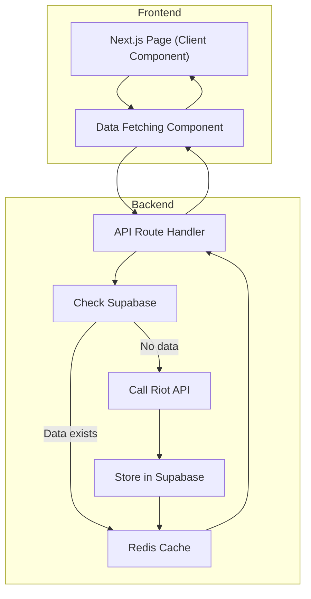

# StatsForge - Project Analysis & Scalability Audit Report

## Critical Issues

### 1. Riot API Misuse in All LoL API Routes
**Files:**
- `app/api/lol/profile/[server]/[username]/[tagline]/route.ts:25-70`
- `app/api/lol/matches/[server]/[puuid]/route.ts:28-74`
- `app/api/lol/ranked/[server]/[puuid]/route.ts:10-33`
- `app/api/lol/mastery/[server]/[puuid]/route.ts:10-31`
- `app/api/lol/matches/[server]/[puuid]/champion-stats/route.ts:43-124`

**Problem:** All LoL API routes call Riot API directly without checking Supabase first, violating the core architectural rule. This causes rate limit issues and poor performance under load.

**Fix Required:** Implement Supabase check first in all API routes, only call Riot API if record doesn't exist.

### 2. Missing Database Tables
**Problem:** The codebase is missing all required LoL player data tables:
- `summoners` - Stores basic summoner information
- `summoner_ranked_stats` - Stores ranked ladder data
- `lol_matches` - Stores match metadata
- `lol_match_participants` - Stores detailed match participant stats
- `summoner_champion_stats` - Stores champion performance stats
- `summoner_update_queue` - Tracks pending updates
- `summoner_last_fetched` - Tracks last data refresh time
- `champions_lol` - Stores champion metadata

**Fix Required:** Create all missing tables in Supabase with appropriate schema.

### 3. No Update Button Implementation
**Problem:** No API endpoint exists for the user to explicitly update their data with an "Update" button.

**Fix Required:** Create an `/api/lol/update` endpoint that:
- Reads `summoner_last_fetched` to get last match timestamp
- Fetches only matches newer than that timestamp from Riot API
- Updates the database with new data

### 4. Summoner Resolution Flow Incomplete
**File:** `app/api/lol/profile/[server]/[username]/[tagline]/route.ts:42-61`

**Problem:** The current profile endpoint resolves Riot ID to PUUID, but doesn't store this information in the database.

**Fix Required:** Implement complete summoner resolution flow:
1. Call account-v1 to get PUUID
2. Call summoner-v4 to get summoner_id  
3. Store both in `summoners` table
4. Return data from database, not directly from Riot API

## Performance Issues

### 5. Sequential Data Fetching
**File:** `app/api/lol/matches/[server]/[puuid]/champion-stats/route.ts:104-124`

**Problem:** Uses sequential `for` loop with delay instead of Promise.all for match fetching.

**Fix Required:** Replace sequential fetching with Promise.all to parallelize match data retrieval.

### 6. Missing Caching Layer
**Problem:** 
- No use of `unstable_cache` or revalidate on Supabase queries
- No Redis implementation
- All data fetched fresh from Riot API on every request

**Fix Required:** Implement:
- Next.js unstable_cache for Supabase queries
- Redis caching for frequent requests
- Revalidation strategy for stale data

### 7. No Database Indexes
**Problem:** No indexes defined on LoL match participant data, which will cause full table scans at scale.

**Fix Required:** Create the following indexes:
- Index on `puuid` in `lol_match_participants`
- Index on `champion_id` in `lol_match_participants`
- Index on `team_position` in `lol_match_participants`
- Index on `win` in `lol_match_participants`
- Composite index on `puuid + team_position + champion_id`

## Missing Features

### 8. No Player Exists Check Pattern
**Problem:** All profile and player pages skip the Supabase check and go straight to Riot API.

**Fix Required:** Implement the exact pattern:
- Check Supabase first for existing player data
- Only call Riot API if record does not exist
- Always return data from Supabase for subsequent requests

### 9. No Champion Metadata Table
**Problem:** Missing `champions_lol` table to store champion metadata (names, IDs, images).

**Fix Required:** Create `champions_lol` table and populate with LoL champion data.

## What Is Working Correctly

### 1. Admin Panel
- TFT champions, items, traits, sets management
- LoL items management
- Admin user management
- All admin API routes properly use Supabase

### 2. Frontend Components
- Match history tab with filters and stats
- Summoner profile header with champion mastery background
- Champion stats card with localStorage caching
- Live game tab functionality

### 3. Current Database Tables
- `tft_champions`, `tft_items`, `tft_traits`, `tft_sets` - TFT data
- `items_lol` - LoL items
- `tft_champion_traits`, `tft_champion_best_items` - TFT relationships

## Prioritized Action Plan

### Phase 1: Foundation (Critical)
1. **Create all missing LoL player data tables** in Supabase with appropriate schema
2. **Fix the summoner resolution flow** in `/api/lol/profile` route to store data in Supabase
3. **Implement Supabase check first** in all LoL API routes
4. **Create the update endpoint** `/api/lol/update` with last fetched timestamp logic

### Phase 2: Performance
5. **Add database indexes** to `lol_match_participants` table
6. **Implement Promise.all** for parallel match fetching
7. **Add unstable_cache** to Supabase queries
8. **Implement Redis caching** for frequent requests

### Phase 3: Features & Polish
9. **Create champions_lol table** and populate with champion metadata
10. **Add proper error handling** for API failures
11. **Implement revalidation strategy** for cached data
12. **Add monitoring and logging** for API endpoints

## Architecture Diagram

This diagram shows the correct flow:
1. Frontend calls API route
2. API checks if data exists in Supabase
3. If data exists, returns cached data
4. If no data, calls Riot API, stores in database, caches, and returns
5. Subsequent calls get cached data from Supabase
